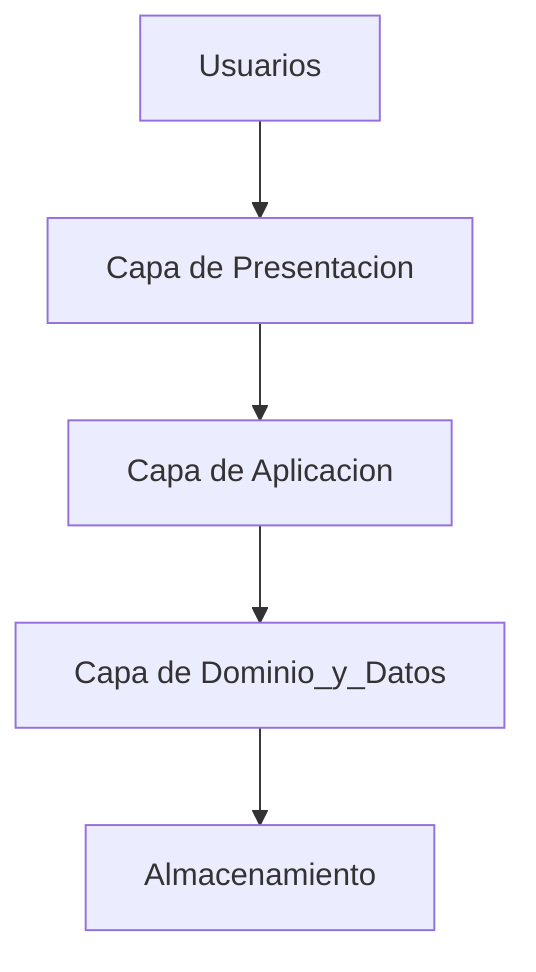
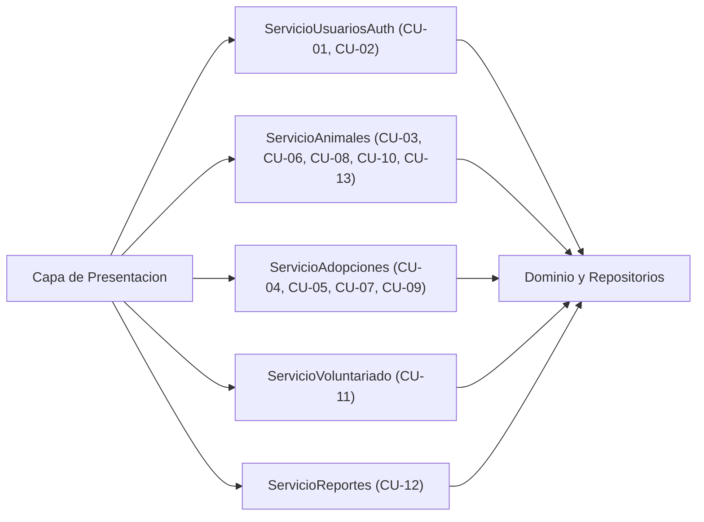
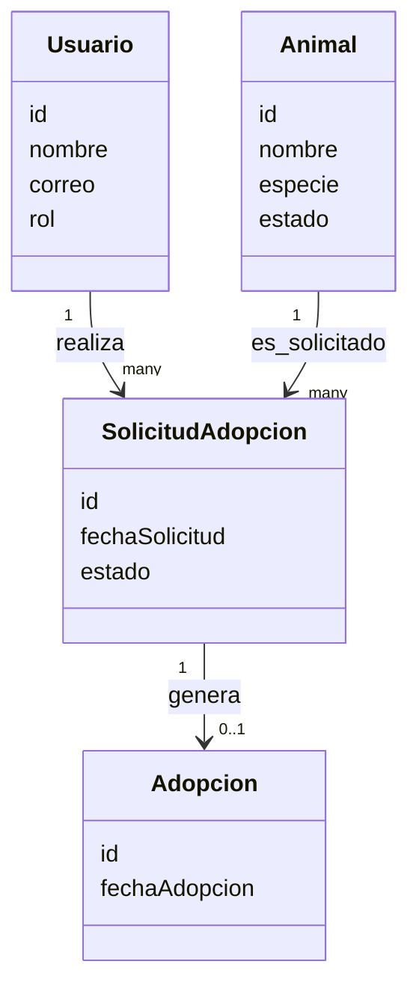

# Arquitectura Lógica – “Patitas Felices”

## 1. Vista general por capas

Aplicación monolítica en **3 capas**:

- **Presentación (UI)**: pantallas, formularios, navegación.
    
- **Aplicación (Servicios de Casos de Uso)**: orquesta lógica de negocio.
    
- **Dominio y Datos**: entidades de negocio y repositorios.
    

---

## 2. Servicios de aplicación y Casos de Uso

La capa de aplicación se organiza por **servicios**, cada uno ligado directamente a casos de uso (CU):

- **ServicioUsuariosAuth**
    
    - CU-01 Registrar Usuario
        
    - CU-02 Iniciar Sesion
        
- **ServicioAnimales**
    
    - CU-03 Registrar Animal Rescatado
        
    - CU-06 Actualizar Estado y Ubicacion del Animal
        
    - CU-08 Consultar Historial Medico del Animal
        
    - CU-10 Consultar Informacion Detallada del Animal
        
    - CU-13 Consultar Ficha y Seguimiento del Animal
        
- **ServicioAdopciones**
    
    - CU-04 Solicitar Adopcion
        
    - CU-05 Gestionar Solicitudes de Adopcion
        
    - CU-07 Registrar Adopcion
        
    - CU-09 Consultar Mis Solicitudes
        
- **ServicioVoluntariado**
    
    - CU-11 Gestionar Actividades de Voluntariado
        
- **ServicioReportes**
    
    - CU-12 Generar Reportes de Adopcion
        

---

## 3. Dominio y Datos (modelo lógico)

Entidades principales (simplificado):

- Usuario, Rol
    
- Animal, EstadoAnimal, Ubicacion
    
- SolicitudAdopcion, HistorialSolicitud, Adopcion
    
- RegistroMedico
    
- ActividadVoluntariado, InscripcionVoluntariado
    

Los repositorios (acceso a datos) se exponen como interfaces lógicas, por ejemplo:

- `RepositorioUsuarios`
    
- `RepositorioAnimales`
    
- `RepositorioSolicitudes`
    
- `RepositorioAdopciones`
    
- `RepositorioVoluntariado`
    
- `RepositorioReportes`
    

---

## 5. Resumen

- Arquitectura: **monolito en tres capas** (Presentacion, Aplicacion, Dominio/Datos).
    
- Servicios de aplicacion mapeados 1 a 1 con grupos de **Casos de Uso CU-01 a CU-13**.
    
- Dominio centrado en entidades clave (Usuario, Animal, SolicitudAdopcion, Adopcion, etc.) y repositorios.