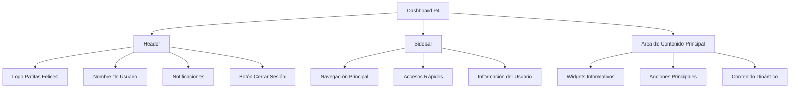
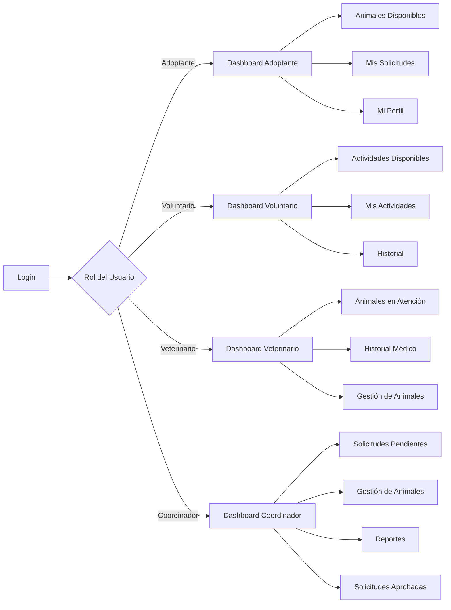

# Dashboard P4 - Funcionalidades por Rol

## Índice
1. [Análisis de Casos de Uso por Rol](#análisis-de-casos-de-uso-por-rol)
2. [Matriz de Funcionalidades por Rol](#matriz-de-funcionalidades-por-rol)
3. [Elementos Comunes del Dashboard](#elementos-comunes-del-dashboard)
4. [Propuesta de Diseño por Rol](#propuesta-de-diseño-por-rol)

---

## Análisis de Casos de Uso por Rol

### CU-03: Registrar Animal Rescatado
- **Rol:** Coordinador de Adopciones
- **Acción:** Registrar información inicial de un animal recién rescatado
- **Botón/Enlace necesario:** "Registrar Animal Rescatado" o "Nuevo Rescate"
- **Ubicación sugerida:** Sidebar principal, sección "Gestión de Animales"

### CU-04: Solicitar Adopción
- **Rol:** Adoptante
- **Acción:** Enviar solicitud formal de adopción para un animal específico
- **Botón/Enlace necesario:** "Animales Disponibles" (navegación) + "Solicitar Adopción" (en ficha del animal)
- **Ubicación sugerida:** Sidebar principal, acceso destacado

### CU-05: Gestionar Solicitudes de Adopción
- **Rol:** Coordinador de Adopciones
- **Acción:** Revisar, aprobar o rechazar solicitudes de adopción pendientes
- **Botón/Enlace necesario:** "Solicitudes Pendientes" o "Gestionar Solicitudes"
- **Ubicación sugerida:** Sidebar principal + Widget de notificaciones con contador

### CU-06: Actualizar Estado y Ubicación del Animal
- **Roles:** Coordinador de Adopciones, Veterinario
- **Acción:** Modificar el estado (En Evaluación, Disponible, etc.) y ubicación del animal
- **Botón/Enlace necesario:** "Gestión de Animales" (lista) + "Actualizar Estado" (en ficha)
- **Ubicación sugerida:** Dentro de la ficha del animal, sección de acciones rápidas

### CU-07: Realizar Adopción
- **Rol:** Coordinador de Adopciones
- **Acción:** Formalizar la adopción de un animal con solicitud aprobada
- **Botón/Enlace necesario:** "Solicitudes Aprobadas" + "Realizar Adopción"
- **Ubicación sugerida:** Sidebar, sección "Adopciones" + Widget de acciones pendientes

### CU-08: Registrar Información Médica
- **Rol:** Veterinario
- **Acción:** Crear el primer registro médico de un animal
- **Botón/Enlace necesario:** "Historial Médico" + "Registrar Información Inicial"
- **Ubicación sugerida:** Sidebar principal, sección "Atención Veterinaria"

### CU-09: Consultar Mis Solicitudes
- **Rol:** Adoptante
- **Acción:** Ver el estado de todas las solicitudes de adopción enviadas
- **Botón/Enlace necesario:** "Mis Solicitudes"
- **Ubicación sugerida:** Sidebar principal, acceso destacado

### CU-10: Gestionar Información Completa del Animal
- **Roles:** Coordinador de Adopciones, Veterinario
- **Acción:** Actualizar datos generales, historia y perfil de adopción del animal
- **Botón/Enlace necesario:** "Gestión de Animales" + "Editar Perfil"
- **Ubicación sugerida:** Dentro de la ficha del animal

### CU-11: Gestionar Actividades de Voluntariado
- **Rol:** Voluntario
- **Acción:** Consultar actividades disponibles, inscribirse y ver historial
- **Botón/Enlace necesario:** "Actividades de Voluntariado" + "Ver Historial"
- **Ubicación sugerida:** Sidebar principal + Widget de próximas actividades

### CU-12: Generar Reportes de Adopción
- **Rol:** Coordinador de Adopciones
- **Acción:** Crear reportes estadísticos sobre adopciones
- **Botón/Enlace necesario:** "Reportes" o "Estadísticas"
- **Ubicación sugerida:** Sidebar, sección "Análisis y Reportes"

### CU-13: Agregar Entrada de Seguimiento Médico al Historial
- **Rol:** Veterinario
- **Acción:** Registrar nueva entrada en el historial médico existente
- **Botón/Enlace necesario:** "Historial Médico" + "Agregar Seguimiento"
- **Ubicación sugerida:** Dentro de la ficha médica del animal

---

## Matriz de Funcionalidades por Rol

### 🏠 Adoptante

#### Navegación Principal (Sidebar)
- **Inicio** - Dashboard con resumen personal
- **Animales Disponibles** - Catálogo de animales adoptables
- **Mis Solicitudes** - Estado de solicitudes enviadas
- **Actividades Disponibles** - Listado de voluntariados abiertos
- **Mis Actividades** - Actividades de voluntariado inscritas
- **Historial de Voluntariado** - Registro de participación en actividades
- **Mi Perfil** - Datos personales y configuración

#### Acciones Disponibles
| Acción | Descripción | Caso de Uso |
|--------|-------------|-------------|
| Ver animales disponibles | Explorar catálogo de animales adoptables | CU-04 |
| Solicitar adopción | Enviar solicitud formal para un animal | CU-04 |
| Consultar mis solicitudes | Ver estado de solicitudes (Pendiente/Aprobada/Rechazada) | CU-09 |
| Ver detalles del animal | Acceder a ficha completa con fotos e información | CU-04 |
| Ver actividades disponibles | Explorar voluntariados con cupos | CU-11 |
| Inscribirse en actividad | Registrarse en una actividad específica | CU-11 |
| Ver mis actividades | Consultar actividades inscritas | CU-11 |
| Ver historial de voluntariado | Revisar actividades completadas y horas | CU-11 |
| Cancelar inscripción | Darse de baja de una actividad (si aplica) | - |
| Actualizar perfil | Modificar datos personales | - |

#### Widgets del Dashboard
- **Mis Solicitudes Activas** - Resumen de solicitudes pendientes y aprobadas
- **Animales Recomendados** - Sugerencias basadas en preferencias
- **Notificaciones** - Actualizaciones sobre solicitudes
- **Próximos Pasos** - Guía si tiene solicitud aprobada
- **Próximas Actividades** - Calendario de actividades de voluntariado inscritas
- **Horas de Voluntariado** - Total de horas acumuladas
- **Actividades Destacadas** - Voluntariados urgentes o especiales

#### Nota sobre Voluntariado
Los Adoptantes tienen acceso completo a las funcionalidades de voluntariado, permitiéndoles participar activamente en actividades de la organización mientras esperan o después de completar una adopción. Esto fomenta el compromiso con la causa y permite a los adoptantes contribuir de manera significativa al bienestar de los animales.

---

### 🤝 Voluntario

#### Navegación Principal (Sidebar)
- **Inicio** - Dashboard con resumen de actividades
- **Actividades Disponibles** - Listado de voluntariados abiertos
- **Mis Actividades** - Actividades inscritas y próximas
- **Historial** - Registro de participación
- **Mi Perfil** - Datos personales y horas acumuladas

#### Acciones Disponibles
| Acción | Descripción | Caso de Uso |
|--------|-------------|-------------|
| Ver actividades disponibles | Explorar voluntariados con cupos | CU-11 |
| Inscribirse en actividad | Registrarse en una actividad específica | CU-11 |
| Ver mis actividades | Consultar actividades inscritas | CU-11 |
| Ver historial | Revisar actividades completadas y horas | CU-11 |
| Cancelar inscripción | Darse de baja de una actividad (si aplica) | - |

#### Widgets del Dashboard
- **Próximas Actividades** - Calendario de actividades inscritas
- **Horas de Voluntariado** - Total de horas acumuladas
- **Actividades Destacadas** - Voluntariados urgentes o especiales
- **Logros** - Reconocimientos y badges por participación

---

### 🩺 Veterinario

#### Navegación Principal (Sidebar)
- **Inicio** - Dashboard con resumen médico
- **Animales en Atención** - Lista de animales bajo cuidado
- **Historial Médico** - Acceso a fichas médicas
- **Gestión de Animales** - Actualizar estado y ubicación
- **Reportes Médicos** - Estadísticas de salud
- **Mi Perfil** - Datos profesionales

#### Acciones Disponibles
| Acción | Descripción | Caso de Uso |
|--------|-------------|-------------|
| Registrar información médica inicial | Crear primer registro médico de un animal | CU-08 |
| Agregar seguimiento médico | Añadir nueva entrada al historial | CU-13 |
| Actualizar estado del animal | Cambiar estado (En Evaluación, Disponible, etc.) | CU-06 |
| Actualizar ubicación | Modificar ubicación actual del animal | CU-06 |
| Gestionar perfil del animal | Editar información general y médica | CU-10 |
| Ver historial completo | Consultar todas las entradas médicas | CU-08, CU-13 |

#### Widgets del Dashboard
- **Animales en Evaluación** - Contador de animales pendientes de revisión
- **Próximos Controles** - Calendario de citas médicas programadas
- **Alertas Médicas** - Animales que requieren atención urgente
- **Estadísticas de Salud** - Resumen de vacunaciones, esterilizaciones, etc.

---

### 👔 Coordinador de Adopciones

#### Navegación Principal (Sidebar)
- **Inicio** - Dashboard ejecutivo con métricas clave
- **Solicitudes Pendientes** - Gestión de solicitudes de adopción
- **Solicitudes Aprobadas** - Adopciones listas para formalizar
- **Gestión de Animales** - CRUD completo de animales
- **Reportes y Estadísticas** - Análisis de adopciones
- **Actividades de Voluntariado** - Gestión de eventos (si aplica)
- **Mi Perfil** - Datos personales

#### Acciones Disponibles
| Acción | Descripción | Caso de Uso |
|--------|-------------|-------------|
| Registrar animal rescatado | Crear expediente de nuevo animal | CU-03 |
| Gestionar solicitudes | Aprobar o rechazar solicitudes de adopción | CU-05 |
| Realizar adopción | Formalizar adopción con solicitud aprobada | CU-07 |
| Actualizar estado del animal | Cambiar estado y ubicación | CU-06 |
| Gestionar perfil del animal | Editar información completa del animal | CU-10 |
| Generar reportes | Crear reportes estadísticos de adopciones | CU-12 |
| Publicar animal | Hacer visible un animal en el catálogo público | - |

#### Widgets del Dashboard
- **Solicitudes Pendientes** - Contador con acceso rápido
- **Adopciones del Mes** - Estadística de adopciones completadas
- **Animales por Estado** - Gráfico de distribución (Disponible, En proceso, etc.)
- **Tiempo Promedio de Adopción** - KPI de eficiencia
- **Alertas y Notificaciones** - Solicitudes nuevas, animales sin actualizar
- **Acciones Rápidas** - Botones para tareas frecuentes

---

## Elementos Comunes del Dashboard

### 🎨 Estructura Base



### Header (Común para todos los roles)

**Elementos:**
- **Logo:** Patitas Felices (izquierda) - enlace al dashboard principal
- **Barra de búsqueda:** (centro) - buscar animales, solicitudes, etc. según rol
- **Notificaciones:** (derecha) - icono con badge de contador
- **Perfil de usuario:** (derecha) - foto, nombre y rol
- **Menú de usuario:** (dropdown)
  - Mi Perfil
  - Configuración
  - Ayuda
  - Cerrar Sesión

**Diseño:**
```
┌─────────────────────────────────────────────────────────────────┐
│ 🐾 Patitas Felices    [🔍 Buscar...]    🔔(3)  👤 Juan Pérez ▼ │
└─────────────────────────────────────────────────────────────────┘
```

### Sidebar (Adaptado por rol)

**Estructura:**
- **Sección superior:** Navegación principal (iconos + texto)
- **Sección media:** Accesos rápidos contextuales
- **Sección inferior:** Información del usuario y configuración

**Comportamiento:**
- Colapsable en dispositivos pequeños
- Ítem activo destacado visualmente
- Badges de notificación en ítems relevantes

**Diseño:**
```
┌──────────────────┐
│ 🏠 Inicio        │
│ 📋 [Función 1]   │
│ 📊 [Función 2]   │
│ ⚙️  [Función 3]   │
│                  │
│ ─────────────    │
│ Accesos Rápidos  │
│ • [Acción 1]     │
│ • [Acción 2]     │
│                  │
│ ─────────────    │
│ 👤 Usuario       │
│ 🔧 Configuración │
└──────────────────┘
```

### Área de Contenido Principal

**Componentes:**
1. **Breadcrumb:** Navegación jerárquica
2. **Título de página:** Contexto actual
3. **Widgets informativos:** Tarjetas con datos relevantes
4. **Área de trabajo:** Formularios, tablas, detalles
5. **Acciones flotantes:** Botones de acción principal (FAB)

---

## Propuesta de Diseño por Rol

### 🏠 Dashboard del Adoptante

#### Layout Principal
```
┌─────────────────────────────────────────────────────────────────┐
│                         HEADER                                   │
├──────────┬──────────────────────────────────────────────────────┤
│          │  Bienvenido, [Nombre]                                │
│ SIDEBAR  │  ┌──────────────┐  ┌──────────────┐  ┌─────────────┐│
│          │  │ Mis          │  │ Animales     │  │ Solicitudes ││
│ • Inicio │  │ Solicitudes  │  │ Recomendados │  │ Aprobadas   ││
│ • Animales│  │ Activas: 2   │  │ 5 nuevos     │  │ 1 pendiente ││
│ • Mis    │  └──────────────┘  └──────────────┘  └─────────────┘│
│   Solicitudes                                                    │
│ • Actividades│ ┌──────────────┐  ┌──────────────┐              │
│   Disponibles│ │ Próximas     │  │ Horas        │              │
│ • Mis    │  │ Actividades  │  │ Acumuladas   │              │
│   Actividades│ │ 3 inscritas  │  │ 45 horas     │              │
│ • Historial│  └──────────────┘  └──────────────┘              │
│ • Perfil │                                                       │
│          │  ┌────────────────────────────────────────────────┐  │
│          │  │ Notificaciones Recientes                       │  │
│          │  │ • Tu solicitud para "Max" fue aprobada         │  │
│          │  │ • Nueva actividad de voluntariado disponible   │  │
│          │  └────────────────────────────────────────────────┘  │
│          │                                                       │
│          │  [Botón: Explorar Animales] [Botón: Ver Actividades]│
└──────────┴───────────────────────────────────────────────────────┘
```

#### Widgets Específicos
1. **Mis Solicitudes Activas**
   - Estado visual (pendiente/aprobada/rechazada)
   - Foto del animal
   - Fecha de solicitud
   - Acción rápida: "Ver detalles"

2. **Animales Recomendados**
   - Carrusel de 3-5 animales
   - Filtrado por preferencias del usuario
   - Botón "Solicitar adopción"

3. **Próximos Pasos**
   - Guía contextual si tiene solicitud aprobada
   - Checklist de documentos necesarios
   - Información de contacto

4. **Próximas Actividades de Voluntariado**
   - Lista de actividades inscritas
   - Fecha, hora y lugar
   - Botón "Ver detalles" / "Cancelar inscripción"

5. **Horas de Voluntariado**
   - Total acumulado
   - Gráfico de progreso mensual
   - Reconocimientos obtenidos

6. **Actividades Destacadas**
   - Voluntariados urgentes
   - Eventos especiales
   - Cupos limitados

---

### 🤝 Dashboard del Voluntario

#### Layout Principal
```
┌─────────────────────────────────────────────────────────────────┐
│                         HEADER                                   │
├──────────┬──────────────────────────────────────────────────────┤
│          │  Hola, [Nombre]                                      │
│ SIDEBAR  │  ┌──────────────┐  ┌──────────────┐  ┌─────────────┐│
│          │  │ Próximas     │  │ Horas        │  │ Actividades ││
│ • Inicio │  │ Actividades  │  │ Acumuladas   │  │ Disponibles ││
│ • Actividades│ 3 inscritas  │  │ 45 horas     │  │ 8 abiertas  ││
│ • Mis    │  └──────────────┘  └──────────────┘  └─────────────┘│
│   Actividades                                                    │
│ • Historial│ ┌────────────────────────────────────────────────┐ │
│ • Perfil │  │ Calendario de Actividades                      │  │
│          │  │ ┌─────┬─────┬─────┬─────┬─────┬─────┬─────┐   │  │
│          │  │ │ Lun │ Mar │ Mié │ Jue │ Vie │ Sáb │ Dom │   │  │
│          │  │ └─────┴─────┴─────┴─────┴─────┴─────┴─────┘   │  │
│          │  └────────────────────────────────────────────────┘  │
│          │                                                       │
│          │  [Botón: Ver Todas las Actividades]                  │
└──────────┴───────────────────────────────────────────────────────┘
```

#### Widgets Específicos
1. **Próximas Actividades**
   - Lista de actividades inscritas
   - Fecha, hora y lugar
   - Botón "Ver detalles" / "Cancelar inscripción"

2. **Horas de Voluntariado**
   - Total acumulado
   - Gráfico de progreso mensual
   - Ranking (opcional)

3. **Actividades Destacadas**
   - Voluntariados urgentes
   - Eventos especiales
   - Cupos limitados

---

### 🩺 Dashboard del Veterinario

#### Layout Principal
```
┌─────────────────────────────────────────────────────────────────┐
│                         HEADER                                   │
├──────────┬──────────────────────────────────────────────────────┤
│          │  Dr./Dra. [Nombre]                                   │
│ SIDEBAR  │  ┌──────────────┐  ┌──────────────┐  ┌─────────────┐│
│          │  │ Animales en  │  │ Próximos     │  │ Alertas     ││
│ • Inicio │  │ Evaluación   │  │ Controles    │  │ Médicas     ││
│ • Animales│  │ 7 pendientes │  │ 4 esta sem.  │  │ 2 urgentes  ││
│ • Historial│ └──────────────┘  └──────────────┘  └─────────────┘│
│   Médico │                                                       │
│ • Gestión│  ┌────────────────────────────────────────────────┐  │
│ • Reportes│ │ Animales Recientes                             │  │
│ • Perfil │  │ • Max - Evaluación inicial pendiente           │  │
│          │  │ • Luna - Control post-esterilización           │  │
│          │  │ • Rocky - Seguimiento de tratamiento           │  │
│          │  └────────────────────────────────────────────────┘  │
│          │                                                       │
│          │  [Botón: Registrar Atención Médica]                  │
└──────────┴───────────────────────────────────────────────────────┘
```

#### Widgets Específicos
1. **Animales en Evaluación**
   - Lista de animales sin registro médico inicial
   - Prioridad por fecha de rescate
   - Acceso rápido a "Registrar información médica"

2. **Próximos Controles**
   - Calendario de citas programadas
   - Recordatorios de vacunas
   - Seguimientos pendientes

3. **Alertas Médicas**
   - Animales con condiciones críticas
   - Medicación por vencer
   - Controles vencidos

4. **Estadísticas de Salud**
   - Gráfico de vacunaciones del mes
   - Esterilizaciones realizadas
   - Tratamientos activos

---

### 👔 Dashboard del Coordinador de Adopciones

#### Layout Principal
```
┌─────────────────────────────────────────────────────────────────┐
│                         HEADER                                   │
├──────────┬──────────────────────────────────────────────────────┤
│          │  Panel de Control - [Nombre]                         │
│ SIDEBAR  │  ┌──────────┐ ┌──────────┐ ┌──────────┐ ┌─────────┐ │
│          │  │Solicitudes│ │Adopciones│ │ Animales │ │ Tiempo  │ │
│ • Inicio │  │Pendientes│ │ del Mes  │ │Disponibles│ │Promedio │ │
│ • Solicitudes│   12     │ │    8     │ │    23    │ │ 18 días │ │
│   Pendientes│└──────────┘ └──────────┘ └──────────┘ └─────────┘ │
│ • Solicitudes│                                                   │
│   Aprobadas│ ┌──────────────────────────────────────────────┐   │
│ • Gestión│   │ Distribución de Animales por Estado          │   │
│   Animales│  │ ┌────────────────────────────────────────┐   │   │
│ • Reportes│  │ │ ████ Disponible (23)                   │   │   │
│ • Perfil │   │ │ ███ En proceso (12)                    │   │   │
│          │   │ │ ██ En evaluación (7)                   │   │   │
│ Accesos  │   │ │ █ Adoptado (145)                       │   │   │
│ Rápidos: │   │ └────────────────────────────────────────┘   │   │
│ • Nuevo  │   └──────────────────────────────────────────────┘   │
│   Rescate│                                                       │
│ • Aprobar│   [Botón: Ver Solicitudes] [Botón: Generar Reporte] │
│   Solicitud│                                                     │
└──────────┴───────────────────────────────────────────────────────┘
```

#### Widgets Específicos
1. **Solicitudes Pendientes**
   - Contador con badge
   - Lista de últimas 5 solicitudes
   - Acceso rápido a "Gestionar"
   - Filtros: Por fecha, por animal

2. **Adopciones del Mes**
   - Número total
   - Comparativa con mes anterior
   - Gráfico de tendencia

3. **Animales por Estado**
   - Gráfico de barras o dona
   - Distribución visual
   - Click para filtrar lista

4. **Tiempo Promedio de Adopción**
   - KPI principal
   - Tendencia (mejorando/empeorando)
   - Objetivo vs. real

5. **Alertas y Notificaciones**
   - Solicitudes nuevas (últimas 24h)
   - Animales sin actualizar (>30 días)
   - Adopciones pendientes de formalizar

6. **Acciones Rápidas**
   - Botón flotante "Registrar Rescate"
   - Acceso directo a tareas frecuentes
   - Atajos de teclado

---

## Diagrama de Navegación General



---

## Consideraciones de Diseño UX/UI

### Paleta de Colores por Rol

- **Adoptante:** Tonos cálidos (naranja, amarillo) - Acogedor y amigable
- **Voluntario:** Tonos verdes - Naturaleza y colaboración
- **Veterinario:** Tonos azules - Profesional y confiable
- **Coordinador:** Tonos morados/grises - Autoridad y gestión

### Principios de Diseño

1. **Claridad:** Información jerárquica y fácil de escanear
2. **Eficiencia:** Máximo 3 clics para cualquier acción principal
3. **Feedback:** Confirmaciones visuales inmediatas
4. **Consistencia:** Patrones de diseño uniformes
5. **Accesibilidad:** Contraste adecuado, textos legibles, navegación por teclado

### Responsive Design

- **Desktop (>1024px):** Layout completo con sidebar expandido
- **Tablet (768-1024px):** Sidebar colapsable, widgets en 2 columnas
- **Mobile (<768px):** Navegación inferior, widgets apilados, menú hamburguesa

---

## Resumen de Botones/Enlaces por Rol

### Adoptante
- ✅ Ver Animales Disponibles
- ✅ Solicitar Adopción
- ✅ Mis Solicitudes
- ✅ Ver Detalles del Animal
- ✅ Actividades Disponibles
- ✅ Inscribirse en Actividad
- ✅ Mis Actividades
- ✅ Ver Historial de Voluntariado
- ✅ Mi Perfil

### Voluntario
- ✅ Actividades Disponibles
- ✅ Inscribirse en Actividad
- ✅ Mis Actividades
- ✅ Ver Historial
- ✅ Mi Perfil

### Veterinario
- ✅ Animales en Atención
- ✅ Registrar Información Médica
- ✅ Agregar Seguimiento Médico
- ✅ Actualizar Estado/Ubicación
- ✅ Gestionar Perfil del Animal
- ✅ Ver Historial Médico

### Coordinador de Adopciones
- ✅ Registrar Animal Rescatado
- ✅ Solicitudes Pendientes
- ✅ Gestionar Solicitudes (Aprobar/Rechazar)
- ✅ Solicitudes Aprobadas
- ✅ Realizar Adopción
- ✅ Gestión de Animales
- ✅ Actualizar Estado/Ubicación
- ✅ Generar Reportes
- ✅ Publicar Animal

---

## Conclusiones

Este documento define la estructura completa del dashboard P4 para cada rol del sistema Patitas Felices. Cada dashboard está diseñado para:

1. **Optimizar el flujo de trabajo** específico de cada rol
2. **Proporcionar información relevante** mediante widgets contextuales
3. **Facilitar acceso rápido** a las funciones más utilizadas
4. **Mantener consistencia visual** mientras se adapta a necesidades específicas
5. **Escalar fácilmente** para agregar nuevas funcionalidades

La implementación debe seguir los principios de Material Design y las mejores prácticas de UX/UI para garantizar una experiencia de usuario óptima.