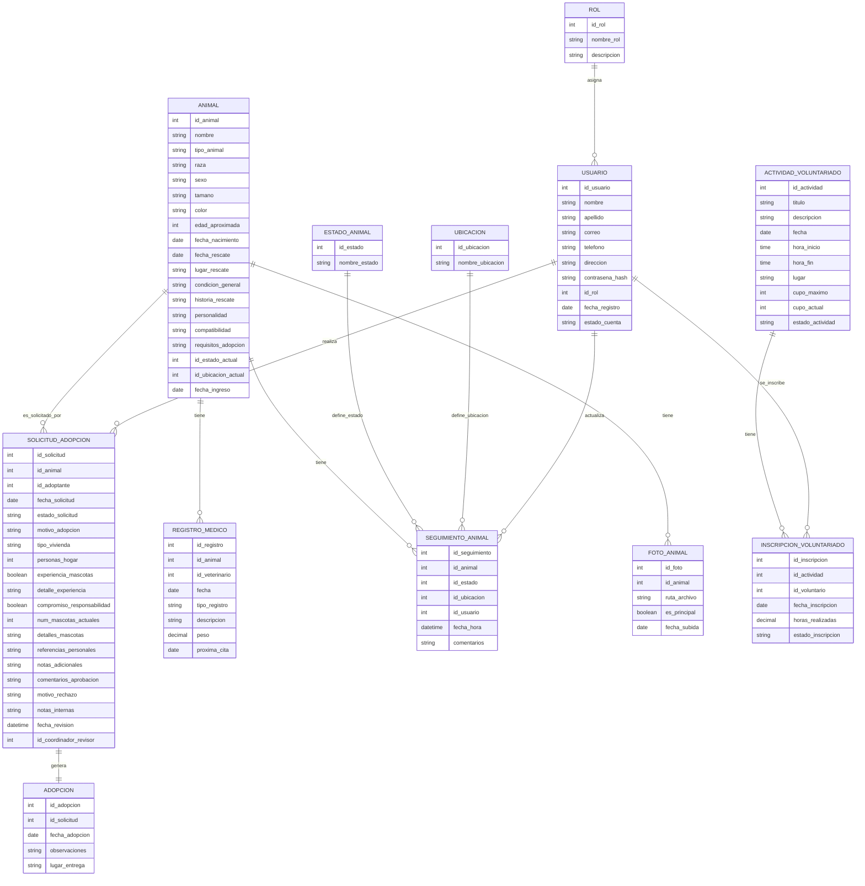

# Diseño de Base de Datos – “Patitas Felices”

## 1. Diagrama Entidad–Relación (MER)

```mermaid
erDiagram
    ROL ||--o{ USUARIO : asigna

    USUARIO {
        int id_usuario
        string nombre
        string apellido
        string correo
        string telefono
        string direccion
        string contrasena_hash
        int id_rol
        date fecha_registro
        string estado_cuenta
    }

    ROL {
        int id_rol
        string nombre_rol
        string descripcion
    }

    ANIMAL ||--o{ SOLICITUD_ADOPCION : es_solicitado_por
    USUARIO ||--o{ SOLICITUD_ADOPCION : realiza

    ANIMAL ||--o{ REGISTRO_MEDICO : tiene
    ANIMAL ||--o{ SEGUIMIENTO_ANIMAL : tiene
    ANIMAL ||--o{ FOTO_ANIMAL : tiene

    SOLICITUD_ADOPCION ||--|| ADOPCION : genera

    ESTADO_ANIMAL ||--o{ SEGUIMIENTO_ANIMAL : define_estado
    UBICACION ||--o{ SEGUIMIENTO_ANIMAL : define_ubicacion
    USUARIO ||--o{ SEGUIMIENTO_ANIMAL : actualiza

    ACTIVIDAD_VOLUNTARIADO ||--o{ INSCRIPCION_VOLUNTARIADO : tiene
    USUARIO ||--o{ INSCRIPCION_VOLUNTARIADO : se_inscribe

    ANIMAL {
        int id_animal
        string nombre
        string tipo_animal
        string raza
        string sexo
        string tamano
        string color
        int edad_aproximada
        date fecha_nacimiento
        date fecha_rescate
        string lugar_rescate
        string condicion_general
        string historia_rescate
        string personalidad
        string compatibilidad
        string requisitos_adopcion
        int id_estado_actual
        int id_ubicacion_actual
        date fecha_ingreso
    }

    ESTADO_ANIMAL {
        int id_estado
        string nombre_estado
    }

    UBICACION {
        int id_ubicacion
        string nombre_ubicacion
    }

    FOTO_ANIMAL {
        int id_foto
        int id_animal
        string ruta_archivo
        boolean es_principal
        date fecha_subida
    }

    SOLICITUD_ADOPCION {
        int id_solicitud
        int id_animal
        int id_adoptante
        date fecha_solicitud
        string estado_solicitud
        string motivo_adopcion
        string tipo_vivienda
        int personas_hogar
        boolean experiencia_mascotas
        string detalle_experiencia
        boolean compromiso_responsabilidad
        int num_mascotas_actuales
        string detalles_mascotas
        string referencias_personales
        string notas_adicionales
        string comentarios_aprobacion
        string motivo_rechazo
        string notas_internas
        datetime fecha_revision
        int id_coordinador_revisor
    }

    ADOPCION {
        int id_adopcion
        int id_solicitud
        date fecha_adopcion
        string observaciones
        string lugar_entrega
    }

    REGISTRO_MEDICO {
        int id_registro
        int id_animal
        int id_veterinario
        date fecha
        string tipo_registro
        string descripcion
        decimal peso
        date proxima_cita
    }

    SEGUIMIENTO_ANIMAL {
        int id_seguimiento
        int id_animal
        int id_estado
        int id_ubicacion
        int id_usuario
        datetime fecha_hora
        string comentarios
    }

    ACTIVIDAD_VOLUNTARIADO {
        int id_actividad
        string titulo
        string descripcion
        date fecha
        time hora_inicio
        time hora_fin
        string lugar
        int cupo_maximo
        int cupo_actual
        string estado_actividad
    }

    INSCRIPCION_VOLUNTARIADO {
        int id_inscripcion
        int id_actividad
        int id_voluntario
        date fecha_inscripcion
        decimal horas_realizadas
        string estado_inscripcion
    }
```