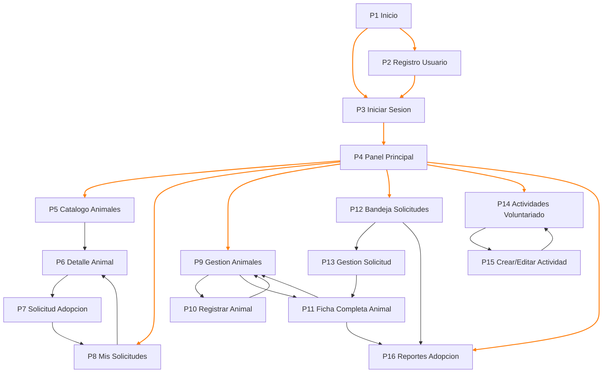

# Páginas y Navegación – Sistema “Patitas Felices”

## 1. Listado de páginas

Total: **16 páginas principales**.

| ID  | Página                         | Rol(es) principal(es)                              | Descripción breve                                                                 | Casos de uso relacionados                         |
|-----|--------------------------------|----------------------------------------------------|------------------------------------------------------------------------------------|---------------------------------------------------|
| P1  | Inicio (Landing)              | Todos                                              | Presentación y acceso a “Iniciar sesión” y “Registrarse”.                        | Soporte a CU-01, CU-02                            |
| P2  | Registro de Usuario           | Adoptante, Voluntario, otros                       | Formulario de alta de usuario.                                                   | **CU-01 Registrar Usuario**                       |
| P3  | Inicio de Sesión              | Todos                                              | Formulario para autenticarse con credenciales.                                   | **CU-02 Iniciar Sesión**                          |
| P4  | Panel Principal (Dashboard)   | Todos (según rol)                                  | Menú de acceso a las funcionalidades según rol.                                  | Origen para la mayoría de CUs                     |
| P5  | Catálogo de Animales          | Adoptante                                          | Lista de animales disponibles para adopción.                                     | Soporte a **CU-04**, vista previa del animal      |
| P6  | Detalle de Animal (Pública)   | Adoptante                                          | Ficha pública del animal con fotos y requisitos de adopción.                     | Soporte a **CU-04**, **CU-13** (vista pública)    |
| P7  | Solicitud de Adopción         | Adoptante                                          | Formulario para crear solicitud de adopción.                                     | **CU-04 Solicitar Adopción**                      |
| P8  | Mis Solicitudes               | Adoptante                                          | Lista de solicitudes del usuario y su estado/comentarios.                        | **CU-09 Consultar Mis Solicitudes**               |
| P9  | Gestión de Animales (Listado) | Coord. Rescates, Coord. Adopciones, Vet, Admin     | Vista interna de todos los animales (filtros por estado, ubicación, etc.).       | **CU-03**, **CU-06**, **CU-10**, **CU-13**        |
| P10 | Registrar Animal Rescatado    | Coord. Rescates                                    | Formulario de alta de animal rescatado.                                          | **CU-03 Registrar Animal Rescatado**              |
| P11 | Ficha Completa del Animal     | Coord. Adopciones, Vet, Coord. Rescates           | Perfil interno completo: datos, historial, seguimiento, registros médicos.       | **CU-06**, **CU-08**, **CU-10**, **CU-13**        |
| P12 | Bandeja de Solicitudes        | Coord. Adopciones                                  | Listado de solicitudes con filtros por estado, fecha, animal, adoptante.         | **CU-05 Gestionar Solicitudes de Adopción**       |
| P13 | Gestión de Solicitud          | Coord. Adopciones                                  | Detalle de solicitud: evaluación, aprobación/rechazo y registro de adopción.     | **CU-05**, **CU-07 Registrar Adopción**           |
| P14 | Actividades de Voluntariado   | Voluntario, Coord. Voluntariado/Adopciones         | Lista de actividades, inscripción, historial de participación.                   | **CU-11 Gestionar Actividades de Voluntariado**   |
| P15 | Crear/Editar Actividad        | Coord. Voluntariado/Adopciones                     | Formulario para crear/editar actividades (fechas, cupos, lugar, horas).          | **CU-11** (lado coordinador)                      |
| P16 | Reportes de Adopción          | Coord. Adopciones, Admin                           | Filtros y visualización de reportes (adopciones, tiempos, estados, periodos).    | **CU-12 Generar Reportes de Adopción**            |

> **Ingeniería de huecos:**  
> - P5 (Catálogo) y P6 (Detalle pública) no están descritas literalmente en los CUs, pero son necesarias para que **CU-04** sea usable.  
> - P4 (Dashboard) es el hub de navegación post login, aunque no sea un CU formal.

---

## 2. Diagrama de navegación  
Las **navegaciones primarias** (flujo principal Inicio → Login/Registro → Dashboard → módulos) están destacadas en otro color.

