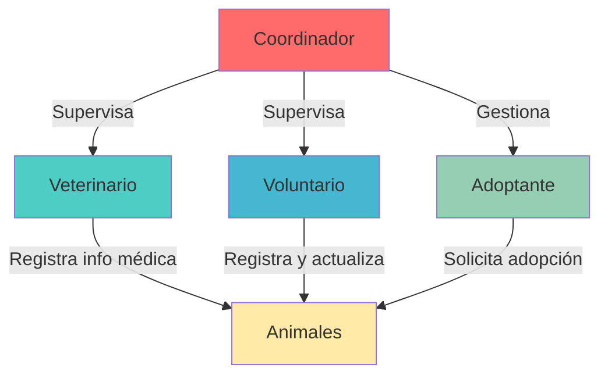

# Sistema de Permisos y Roles - Patitas Felices

## 📋 Tabla de Contenidos

1. [Introducción](#introducción)
2. [Roles del Sistema](#roles-del-sistema)
3. [Gestión de Permisos](#gestión-de-permisos)
4. [Estrategias de Implementación](#estrategias-de-implementación)
5. [Middleware de Autenticación](#middleware-de-autenticación)
6. [Arquitectura de Dashboards](#arquitectura-de-dashboards)
7. [Ejemplos de Implementación](#ejemplos-de-implementación)
8. [Mejores Prácticas](#mejores-prácticas)
9. [Casos de Uso por Rol](#casos-de-uso-por-rol)

---

## 📖 Introducción

El sistema de permisos y roles de "Patitas Felices" está diseñado para controlar el acceso a diferentes funcionalidades según el tipo de usuario. Este documento explica cómo funcionan los roles, cómo gestionar permisos y las estrategias recomendadas para implementar el control de acceso en el proyecto P4.

### Objetivos del Sistema

- **Seguridad**: Garantizar que cada usuario solo acceda a las funcionalidades permitidas
- **Simplicidad**: Mantener una implementación clara y fácil de mantener
- **Escalabilidad**: Permitir agregar nuevos roles o permisos en el futuro
- **Usabilidad**: Proporcionar experiencias personalizadas según el rol del usuario

---

## 👥 Roles del Sistema

El sistema cuenta con **4 roles principales**, cada uno con responsabilidades y permisos específicos.

### Tabla de Roles

| ID | Rol | Descripción | Nivel de Acceso |
|----|-----|-------------|-----------------|
| 1 | **Adoptante** | Usuario que busca adoptar animales y puede participar en actividades de voluntariado | Básico + Voluntariado |
| 2 | **Voluntario** | Usuario que registra animales y gestiona actividades | Intermedio |
| 3 | **Veterinario** | Profesional que gestiona información médica | Especializado |
| 4 | **Coordinador** | Administrador del sistema con acceso completo | Completo |

### Diagrama de Jerarquía



---

## 🔐 Gestión de Permisos

### Dos Enfoques Principales

#### 1. Variable de Sesión (Recomendado para P4)

**Ventajas:**
- ✅ Implementación simple y rápida
- ✅ No requiere consultas adicionales a BD
- ✅ Rendimiento óptimo
- ✅ Ideal para proyectos académicos

**Desventajas:**
- ❌ Menos flexible para permisos granulares
- ❌ Requiere cerrar sesión para actualizar permisos

**Implementación:**

```php
<?php
// Al iniciar sesión (login.php)
$_SESSION['usuario_id'] = $usuario['id_usuario'];
$_SESSION['usuario_rol'] = $usuario['rol']; // 'Coordinador', 'Veterinario', etc.
$_SESSION['usuario_id_rol'] = $usuario['id_rol']; // 1, 2, 3, 4

// Verificación de permisos
function tienePermiso($rolRequerido) {
    return isset($_SESSION['usuario_rol']) && 
           $_SESSION['usuario_rol'] === $rolRequerido;
}

function tieneAlgunPermiso($rolesPermitidos) {
    return isset($_SESSION['usuario_rol']) && 
           in_array($_SESSION['usuario_rol'], $rolesPermitidos);
}
?>
```

#### 2. Consulta a Base de Datos

**Ventajas:**
- ✅ Permisos actualizados en tiempo real
- ✅ Mayor flexibilidad y granularidad
- ✅ Permite permisos específicos por funcionalidad

**Desventajas:**
- ❌ Más complejo de implementar
- ❌ Requiere consultas adicionales
- ❌ Puede afectar el rendimiento

**Implementación:**

```php
<?php
// Tabla adicional en BD: PERMISO_ROL
// Campos: id_permiso_rol, id_rol, nombre_permiso, descripcion

function tienePermisoEspecifico($idUsuario, $nombrePermiso) {
    $sql = "SELECT COUNT(*) as tiene_permiso
            FROM USUARIO u
            INNER JOIN ROL r ON u.id_rol = r.id_rol
            INNER JOIN PERMISO_ROL pr ON r.id_rol = pr.id_rol
            WHERE u.id_usuario = :id_usuario 
            AND pr.nombre_permiso = :permiso";
    
    // Ejecutar consulta y retornar resultado
}
?>
```

### Recomendación para P4

**Usar el enfoque de Variable de Sesión** por las siguientes razones:

1. **Simplicidad**: El proyecto es académico y no requiere complejidad adicional
2. **Tiempo**: Implementación más rápida
3. **Suficiencia**: Los 4 roles cubren todas las necesidades del sistema
4. **Mantenibilidad**: Código más fácil de entender y mantener

---

## 🎯 Estrategias de Implementación

### Opción A: Dashboard Único con Secciones Condicionales (Recomendado)

**Descripción:** Un solo archivo `dashboard.php` que muestra diferentes secciones según el rol del usuario.

**Ventajas:**
- ✅ Menos archivos que mantener
- ✅ Código centralizado
- ✅ Fácil de actualizar
- ✅ Navegación consistente

**Estructura:**

```
public/
├── dashboard/
│   ├── index.php              # Dashboard principal único
│   ├── components/
│   │   ├── sidebar.php        # Menú lateral dinámico
│   │   ├── header.php         # Encabezado con info de usuario
│   │   └── footer.php
│   └── sections/              # Secciones por funcionalidad
│       ├── animales.php
│       ├── adopciones.php
│       ├── medico.php
│       ├── voluntariado.php
│       └── reportes.php
```

**Ejemplo de Implementación:**

```php
<?php
// public/dashboard/index.php
session_start();
require_once '../../src/middleware/auth.php';
requireAuth();

$rol = $_SESSION['usuario_rol'];
$seccion = $_GET['seccion'] ?? 'inicio';

// Definir secciones permitidas por rol
$seccionesPermitidas = [
    'Adoptante' => ['inicio', 'animales', 'mis-solicitudes'],
    'Voluntario' => ['inicio', 'animales', 'registrar-animal', 'voluntariado'],
    'Veterinario' => ['inicio', 'animales', 'medico', 'historial-medico'],
    'Coordinador' => ['inicio', 'animales', 'adopciones', 'medico', 'voluntariado', 'reportes', 'usuarios']
];

// Verificar permiso para la sección
if (!in_array($seccion, $seccionesPermitidas[$rol])) {
    $seccion = 'inicio';
}
?>

<!DOCTYPE html>
<html lang="es">
<head>
    <meta charset="UTF-8">
    <title>Dashboard - Patitas Felices</title>
    <link rel="stylesheet" href="/css/dashboard.css">
</head>
<body>
    <div class="dashboard-container">
        <?php include 'components/sidebar.php'; ?>
        
        <main class="dashboard-content">
            <?php include 'components/header.php'; ?>
            
            <div class="content-area">
                <?php
                // Cargar la sección correspondiente
                $archivoSeccion = "sections/{$seccion}.php";
                if (file_exists($archivoSeccion)) {
                    include $archivoSeccion;
                } else {
                    include 'sections/inicio.php';
                }
                ?>
            </div>
            
            <?php include 'components/footer.php'; ?>
        </main>
    </div>
</body>
</html>
```

**Sidebar Dinámico:**

```php
<?php
// public/dashboard/components/sidebar.php
$rol = $_SESSION['usuario_rol'];

// Definir menú por rol
$menuItems = [
    'Adoptante' => [
        ['icono' => '🏠', 'texto' => 'Inicio', 'url' => '?seccion=inicio'],
        ['icono' => '🐾', 'texto' => 'Animales Disponibles', 'url' => '?seccion=animales'],
        ['icono' => '📋', 'texto' => 'Mis Solicitudes', 'url' => '?seccion=mis-solicitudes']
    ],
    'Voluntario' => [
        ['icono' => '🏠', 'texto' => 'Inicio', 'url' => '?seccion=inicio'],
        ['icono' => '🐾', 'texto' => 'Animales', 'url' => '?seccion=animales'],
        ['icono' => '➕', 'texto' => 'Registrar Animal', 'url' => '?seccion=registrar-animal'],
        ['icono' => '🤝', 'texto' => 'Voluntariado', 'url' => '?seccion=voluntariado']
    ],
    'Veterinario' => [
        ['icono' => '🏠', 'texto' => 'Inicio', 'url' => '?seccion=inicio'],
        ['icono' => '🐾', 'texto' => 'Animales', 'url' => '?seccion=animales'],
        ['icono' => '🏥', 'texto' => 'Información Médica', 'url' => '?seccion=medico'],
        ['icono' => '📊', 'texto' => 'Historial Médico', 'url' => '?seccion=historial-medico']
    ],
    'Coordinador' => [
        ['icono' => '🏠', 'texto' => 'Inicio', 'url' => '?seccion=inicio'],
        ['icono' => '🐾', 'texto' => 'Animales', 'url' => '?seccion=animales'],
        ['icono' => '📝', 'texto' => 'Adopciones', 'url' => '?seccion=adopciones'],
        ['icono' => '🏥', 'texto' => 'Información Médica', 'url' => '?seccion=medico'],
        ['icono' => '🤝', 'texto' => 'Voluntariado', 'url' => '?seccion=voluntariado'],
        ['icono' => '📊', 'texto' => 'Reportes', 'url' => '?seccion=reportes'],
        ['icono' => '👥', 'texto' => 'Usuarios', 'url' => '?seccion=usuarios']
    ]
];

$menu = $menuItems[$rol] ?? [];
?>

<aside class="sidebar">
    <div class="sidebar-header">
        <h2>🐾 Patitas Felices</h2>
        <p class="user-role"><?= htmlspecialchars($rol) ?></p>
    </div>
    
    <nav class="sidebar-nav">
        <ul>
            <?php foreach ($menu as $item): ?>
                <li>
                    <a href="<?= htmlspecialchars($item['url']) ?>" 
                       class="<?= ($_GET['seccion'] ?? 'inicio') === basename($item['url'], '.php') ? 'active' : '' ?>">
                        <span class="icon"><?= $item['icono'] ?></span>
                        <span class="text"><?= htmlspecialchars($item['texto']) ?></span>
                    </a>
                </li>
            <?php endforeach; ?>
        </ul>
    </nav>
    
    <div class="sidebar-footer">
        <a href="/logout.php" class="btn-logout">
            <span class="icon">🚪</span>
            <span class="text">Cerrar Sesión</span>
        </a>
    </div>
</aside>
```

### Opción B: Múltiples Páginas de Dashboard

**Descripción:** Un archivo separado para cada rol (`coordinador.php`, `veterinario.php`, etc.).

**Ventajas:**
- ✅ Separación clara de responsabilidades
- ✅ Código específico por rol
- ✅ Más fácil de proteger cada página

**Desventajas:**
- ❌ Más archivos que mantener
- ❌ Código duplicado entre dashboards
- ❌ Más difícil mantener consistencia

**Estructura:**

```
public/
├── dashboard/
│   ├── adoptante.php
│   ├── voluntario.php
│   ├── veterinario.php
│   ├── coordinador.php
│   └── shared/
│       ├── header.php
│       ├── footer.php
│       └── functions.php
```

**Ejemplo:**

```php
<?php
// public/dashboard/coordinador.php
session_start();
require_once '../../src/middleware/auth.php';
requireRole('Coordinador');

$nombre = $_SESSION['usuario_nombre'];
?>

<!DOCTYPE html>
<html lang="es">
<head>
    <meta charset="UTF-8">
    <title>Dashboard Coordinador - Patitas Felices</title>
</head>
<body>
    <?php include 'shared/header.php'; ?>
    
    <h1>Bienvenido, Coordinador <?= htmlspecialchars($nombre) ?></h1>
    
    <div class="dashboard-grid">
        <div class="card">
            <h3>📊 Reportes</h3>
            <a href="/reportes/adopciones.php">Ver Reportes de Adopción</a>
        </div>
        
        <div class="card">
            <h3>👥 Usuarios</h3>
            <a href="/usuarios/listar.php">Gestionar Usuarios</a>
        </div>
        
        <div class="card">
            <h3>🐾 Animales</h3>
            <a href="/animales/listar.php">Ver Todos los Animales</a>
        </div>
        
        <div class="card">
            <h3>📝 Adopciones</h3>
            <a href="/adopciones/gestionar.php">Gestionar Solicitudes</a>
        </div>
    </div>
    
    <?php include 'shared/footer.php'; ?>
</body>
</html>
```

### Comparación de Estrategias

| Aspecto | Dashboard Único | Múltiples Dashboards |
|---------|----------------|---------------------|
| **Mantenibilidad** | ⭐⭐⭐⭐⭐ Alta | ⭐⭐⭐ Media |
| **Complejidad** | ⭐⭐⭐ Media | ⭐⭐ Baja |
| **Escalabilidad** | ⭐⭐⭐⭐⭐ Alta | ⭐⭐⭐ Media |
| **Consistencia UI** | ⭐⭐⭐⭐⭐ Alta | ⭐⭐⭐ Media |
| **Tiempo de desarrollo** | ⭐⭐⭐⭐ Rápido | ⭐⭐⭐⭐⭐ Muy rápido |

**Recomendación:** **Dashboard Único** para mejor mantenibilidad y escalabilidad.

---

## 🛡️ Middleware de Autenticación

### Archivo de Middleware

Crear un archivo centralizado para gestionar la autenticación y autorización.

```php
<?php
/**
 * Middleware de Autenticación y Autorización
 * src/middleware/auth.php
 */

/**
 * Inicia la sesión si no está iniciada
 */
function iniciarSesionSiNoExiste() {
    if (session_status() === PHP_SESSION_NONE) {
        session_start();
    }
}

/**
 * Verifica que el usuario esté autenticado
 * Redirige a login si no lo está
 */
function requireAuth() {
    iniciarSesionSiNoExiste();
    
    if (!isset($_SESSION['usuario_id'])) {
        // Guardar URL actual para redirigir después del login
        $_SESSION['redirect_after_login'] = $_SERVER['REQUEST_URI'];
        header('Location: /login.php');
        exit;
    }
}

/**
 * Verifica que el usuario NO esté autenticado
 * Redirige al dashboard si ya está autenticado
 */
function requireGuest() {
    iniciarSesionSiNoExiste();
    
    if (isset($_SESSION['usuario_id'])) {
        header('Location: /dashboard/index.php');
        exit;
    }
}

/**
 * Verifica que el usuario tenga un rol específico
 * 
 * @param string|array $rolesPermitidos Rol o array de roles permitidos
 * @param string $mensajeError Mensaje personalizado de error (opcional)
 */
function requireRole($rolesPermitidos, $mensajeError = null) {
    requireAuth();
    
    $rolesPermitidos = (array) $rolesPermitidos;
    $rolUsuario = $_SESSION['usuario_rol'] ?? '';
    
    if (!in_array($rolUsuario, $rolesPermitidos)) {
        http_response_code(403);
        
        if ($mensajeError) {
            die($mensajeError);
        }
        
        die('
            <h1>Acceso Denegado</h1>
            <p>No tiene permisos para acceder a esta página.</p>
            <p>Rol requerido: ' . implode(', ', $rolesPermitidos) . '</p>
            <p>Su rol: ' . htmlspecialchars($rolUsuario) . '</p>
            <a href="/dashboard/index.php">Volver al Dashboard</a>
        ');
    }
}

/**
 * Verifica si el usuario tiene un rol específico (sin redirigir)
 * 
 * @param string|array $roles Rol o array de roles a verificar
 * @return bool True si tiene el rol, false si no
 */
function hasRole($roles) {
    iniciarSesionSiNoExiste();
    
    if (!isset($_SESSION['usuario_rol'])) {
        return false;
    }
    
    $roles = (array) $roles;
    return in_array($_SESSION['usuario_rol'], $roles);
}

/**
 * Verifica si el usuario es el propietario del recurso
 * 
 * @param int $idPropietario ID del propietario del recurso
 * @return bool True si es el propietario, false si no
 */
function isOwner($idPropietario) {
    iniciarSesionSiNoExiste();
    
    return isset($_SESSION['usuario_id']) && 
           $_SESSION['usuario_id'] == $idPropietario;
}

/**
 * Verifica si el usuario puede acceder al recurso
 * (es propietario O tiene uno de los roles permitidos)
 * 
 * @param int $idPropietario ID del propietario del recurso
 * @param string|array $rolesPermitidos Roles que pueden acceder
 * @return bool True si puede acceder, false si no
 */
function canAccess($idPropietario, $rolesPermitidos) {
    return isOwner($idPropietario) || hasRole($rolesPermitidos);
}

/**
 * Obtiene información del usuario actual
 * 
 * @return array|null Array con datos del usuario o null si no está autenticado
 */
function getCurrentUser() {
    iniciarSesionSiNoExiste();
    
    if (!isset($_SESSION['usuario_id'])) {
        return null;
    }
    
    return [
        'id' => $_SESSION['usuario_id'],
        'nombre' => $_SESSION['usuario_nombre'] ?? '',
        'correo' => $_SESSION['usuario_correo'] ?? '',
        'rol' => $_SESSION['usuario_rol'] ?? '',
        'id_rol' => $_SESSION['usuario_id_rol'] ?? null
    ];
}

/**
 * Cierra la sesión del usuario
 */
function logout() {
    iniciarSesionSiNoExiste();
    
    // Limpiar todas las variables de sesión
    $_SESSION = [];
    
    // Destruir la cookie de sesión
    if (isset($_COOKIE[session_name()])) {
        setcookie(session_name(), '', time() - 3600, '/');
    }
    
    // Destruir la sesión
    session_destroy();
}
?>
```

### Ejemplos de Uso del Middleware

#### 1. Proteger una Página (Solo Autenticados)

```php
<?php
// public/dashboard/index.php
require_once '../../src/middleware/auth.php';
requireAuth();

// El resto del código solo se ejecuta si está autenticado
?>
```

#### 2. Proteger por Rol Específico

```php
<?php
// public/reportes/adopciones.php
require_once '../../src/middleware/auth.php';
requireRole('Coordinador');

// Solo coordinadores pueden acceder
?>
```

#### 3. Permitir Múltiples Roles

```php
<?php
// public/animales/editar.php
require_once '../../src/middleware/auth.php';
requireRole(['Coordinador', 'Voluntario']);

// Coordinadores y voluntarios pueden acceder
?>
```

#### 4. Verificación Condicional

```php
<?php
// public/animales/ver.php
require_once '../../src/middleware/auth.php';
requireAuth();

$usuario = getCurrentUser();

// Mostrar botones según el rol
if (hasRole('Coordinador')) {
    echo '<button>Eliminar Animal</button>';
}

if (hasRole(['Coordinador', 'Voluntario'])) {
    echo '<button>Editar Animal</button>';
}

if (hasRole('Adoptante')) {
    echo '<button>Solicitar Adopción</button>';
}
?>
```

#### 5. Verificar Propiedad de Recurso

```php
<?php
// public/solicitudes/editar.php
require_once '../../src/middleware/auth.php';
requireAuth();

$idSolicitud = $_GET['id'] ?? 0;
// Obtener solicitud de BD
$solicitud = obtenerSolicitud($idSolicitud);

// Solo el propietario o coordinador puede editar
if (!canAccess($solicitud['id_usuario'], 'Coordinador')) {
    http_response_code(403);
    die('No tiene permisos para editar esta solicitud');
}

// Continuar con la edición
?>
```

#### 6. Página Solo para Invitados

```php
<?php
// public/login.php
require_once '../src/middleware/auth.php';
requireGuest();

// Si ya está autenticado, se redirige al dashboard
// Solo usuarios no autenticados ven el formulario de login
?>
```

---

## 🏗️ Arquitectura de Dashboards

### Estructura de Archivos Recomendada

```
public/
├── dashboard/
│   ├── index.php                    # Dashboard principal
│   │
│   ├── components/                  # Componentes reutilizables
│   │   ├── sidebar.php             # Menú lateral dinámico
│   │   ├── header.php              # Encabezado con info usuario
│   │   ├── footer.php              # Pie de página
│   │   ├── breadcrumb.php          # Navegación de migas de pan
│   │   └── notifications.php       # Sistema de notificaciones
│   │
│   ├── sections/                    # Secciones del dashboard
│   │   ├── inicio.php              # Página de inicio
│   │   ├── animales.php            # Lista de animales
│   │   ├── registrar-animal.php    # Formulario registro
│   │   ├── adopciones.php          # Gestión de adopciones
│   │   ├── mis-solicitudes.php     # Solicitudes del usuario
│   │   ├── medico.php              # Información médica
│   │   ├── historial-medico.php    # Historial médico
│   │   ├── voluntariado.php        # Actividades voluntariado
│   │   ├── reportes.php            # Reportes y estadísticas
│   │   └── usuarios.php            # Gestión de usuarios
│   │
│   └── assets/                      # Recursos del dashboard
│       ├── css/
│       │   └── dashboard.css
│       ├── js/
│       │   └── dashboard.js
│       └── img/
│
├── api/                             # API endpoints
│   ├── animales/
│   ├── adopciones/
│   └── auth/
│
└── logout.php                       # Cerrar sesión
```

### Componente Header

```php
<?php
// public/dashboard/components/header.php
$usuario = getCurrentUser();
?>

<header class="dashboard-header">
    <div class="header-left">
        <button id="toggle-sidebar" class="btn-icon">☰</button>
        <h1 class="page-title">
            <?php
            $titulos = [
                'inicio' => 'Inicio',
                'animales' => 'Animales',
                'registrar-animal' => 'Registrar Animal',
                'adopciones' => 'Gestión de Adopciones',
                'mis-solicitudes' => 'Mis Solicitudes',
                'medico' => 'Información Médica',
                'historial-medico' => 'Historial Médico',
                'voluntariado' => 'Voluntariado',
                'reportes' => 'Reportes',
                'usuarios' => 'Gestión de Usuarios'
            ];
            
            $seccion = $_GET['seccion'] ?? 'inicio';
            echo $titulos[$seccion] ?? 'Dashboard';
            ?>
        </h1>
    </div>
    
    <div class="header-right">
        <div class="user-info">
            <span class="user-name"><?= htmlspecialchars($usuario['nombre']) ?></span>
            <span class="user-role"><?= htmlspecialchars($usuario['rol']) ?></span>
        </div>
        
        <div class="user-menu">
            <button class="btn-user-menu">
                
            </button>
            <div class="user-dropdown">
                <a href="?seccion=perfil">👤 Mi Perfil</a>
                <a href="?seccion=configuracion">⚙️ Configuración</a>
                <hr>
                <a href="/logout.php">🚪 Cerrar Sesión</a>
            </div>
        </div>
    </div>
</header>
```

### Página de Inicio Dinámica

```php
<?php
// public/dashboard/sections/inicio.php
$usuario = getCurrentUser();
$rol = $usuario['rol'];

// Estadísticas según el rol
$estadisticas = [];

switch ($rol) {
    case 'Adoptante':
        $estadisticas = [
            ['titulo' => 'Mis Solicitudes', 'valor' => '3', 'icono' => '📋'],
            ['titulo' => 'Animales Favoritos', 'valor' => '5', 'icono' => '❤️'],
            ['titulo' => 'Adopciones Completadas', 'valor' => '1', 'icono' => '✅']
        ];
        break;
        
    case 'Voluntario':
        $estadisticas = [
            ['titulo' => 'Animales Registrados', 'valor' => '12', 'icono' => '🐾'],
            ['titulo' => 'Actividades Este Mes', 'valor' => '8', 'icono' => '📅'],
            ['titulo' => 'Horas Voluntariado', 'valor' => '24', 'icono' => '⏰']
        ];
        break;
        
    case 'Veterinario':
        $estadisticas = [
            ['titulo' => 'Animales Bajo Cuidado', 'valor' => '18', 'icono' => '🏥'],
            ['titulo' => 'Consultas Este Mes', 'valor' => '32', 'icono' => '📋'],
            ['titulo' => 'Vacunas Pendientes', 'valor' => '5', 'icono' => '💉']
        ];
        break;
        
    case 'Coordinador':
        $estadisticas = [
            ['titulo' => 'Total Animales', 'valor' => '45', 'icono' => '🐾'],
            ['titulo' => 'Solicitudes Pendientes', 'valor' => '12', 'icono' => '📝'],
            ['titulo' => 'Adopciones Este Mes', 'valor' => '8', 'icono' => '✅'],
            ['titulo' => 'Usuarios Activos', 'valor' => '67', 'icono' => '👥']
        ];
        break;
}
?>

<div class="inicio-container">
    <div class="welcome-banner">
        <h2>¡Bienvenido, <?= htmlspecialchars($usuario['nombre']) ?>!</h2>
        <p>Rol: <strong><?= htmlspecialchars($rol) ?></strong></p>
    </div>
    
    <div class="stats-grid">
        <?php foreach ($estadisticas as $stat): ?>
            <div class="stat-card">
                <div class="stat-icon"><?= $stat['icono'] ?></div>
                <div class="stat-info">
                    <h3><?= $stat['valor'] ?></h3>
                    <p><?= $stat['titulo'] ?></p>
                </div>
            </div>
        <?php endforeach; ?>
    </div>
    
    <div class="quick-actions">
        <h3>Acciones Rápidas</h3>
        <div class="actions-grid">
            <?php if ($rol === 'Adoptante'): ?>
                <a href="?seccion=animales" class="action-btn">
                    🐾 Ver Animales Disponibles
                </a>
                <a href="?seccion=mis-solicitudes" class="action-btn">
                    📋 Mis Solicitudes
                </a>
            <?php elseif ($rol === 'Voluntario'): ?>
                <a href="?seccion=registrar-animal" class="action-btn">
                    ➕ Registrar Animal
                </a>
                <a href="?seccion=voluntariado" class="action-btn">
                    🤝 Registrar Actividad
                </a>
            <?php elseif ($rol === 'Veterinario'): ?>
                <a href="?seccion=medico" class="action-btn">
                    🏥 Registrar Info Médica
                </a>
                <a href="?seccion=historial-medico" class="action-btn">
                    📊 Ver Historial
                </a>
            <?php elseif ($rol === 'Coordinador'): ?>
                <a href="?seccion=adopciones" class="action-btn">
                    📝 Gestionar Adopciones
                </a>
                <a href="?seccion=reportes" class="action-btn">
                    📊 Ver Reportes
                </a>
                <a href="?seccion=usuarios" class="action-btn">
                    👥 Gestionar Usuarios
                </a>
            <?php endif; ?>
        </div>
    </div>
</div>
```

---

## 💻 Ejemplos de Implementación

### Ejemplo 1: Protección de Formulario de Registro de Animal

```php
<?php
// public/dashboard/sections/registrar-animal.php
require_once '../../../src/middleware/auth.php';

// Solo Voluntarios y Coordinadores pueden registrar animales
if (!hasRole(['Voluntario', 'Coordinador'])) {
    echo '<div class="alert alert-danger">';
    echo 'No tiene permisos para registrar animales.';
    echo '</div>';
    return;
}

// Mostrar formulario
?>

<div class="form-container">
    <h2>Registrar Nuevo Animal</h2>
    
    <form method="POST" action="/api/animales/crear.php" enctype="multipart/form-data">
        <div class="form-group">
            <label>Nombre del Animal *</label>
            <input type="text" name="nombre" required>
        </div>
        
        <div class="form-group">
            <label>Especie *</label>
            <select name="especie" required>
                <option value="">Seleccione...</option>
                <option value="Perro">Perro</option>
                <option value="Gato">Gato</option>
            </select>
        </div>
        
        <!-- Más campos... -->
        
        <button type="submit" class="btn btn-primary">Registrar Animal</button>
    </form>
</div>
```

### Ejemplo 2: Lista de Animales con Acciones Según Rol

```php
<?php
// public/dashboard/sections/animales.php
require_once '../../../src/middleware/auth.php';
requireAuth();

$rol = $_SESSION['usuario_rol'];
$animales = obtenerAnimales(); // Función que obtiene animales de BD
?>

<div class="animales-container">
    <div class="page-header">
        <h2>Animales</h2>
        
        <?php if (hasRole(['Voluntario', 'Coordinador'])): ?>
            <a href="?seccion=registrar-animal" class="btn btn-primary">
                ➕ Registrar Nuevo Animal
            </a>
        <?php endif; ?>
    </div>
    
    <div class="animales-grid">
        <?php foreach ($animales as $animal): ?>
            <div class="animal-card">
                " alt="<?= htmlspecialchars($animal['nombre']) ?>">
                
                <div class="animal-info">
                    <h3><?= htmlspecialchars($animal['nombre']) ?></h3>
                    <p><?= htmlspecialchars($animal['especie']) ?> - <?= htmlspecialchars($animal['raza']) ?></p>
                    <p>Estado: <span class="badge"><?= htmlspecialchars($animal['estado']) ?></span></p>
                </div>
                
                <div class="animal-actions">
                    <a href="/animales/ver.php?id=<?= $animal['id_animal'] ?>" class="btn btn-sm">
                        👁️ Ver Detalles
                    </a>
                    
                    <?php if (hasRole('Adoptante') && $animal['estado'] === 'DISPONIBLE'): ?>
                        <a href="/adopciones/solicitar.php?id=<?= $animal['id_animal'] ?>" class="btn btn-sm btn-success">
                            ❤️ Solicitar Adopción
                        </a>
                    <?php endif; ?>
                    
                    <?php if (hasRole(['Voluntario', 'Coordinador'])): ?>
                        <a href="/animales/editar.php?id=<?= $animal['id_animal'] ?>" class="btn btn-sm btn-warning">
                            ✏️ Editar
                        </a>
                    <?php endif; ?>
                    
                    <?php if (hasRole('Veterinario')): ?>
                        <a href="/medico/registrar.php?id=<?= $animal['id_animal'] ?>" class="btn btn-sm btn-info">
                            🏥 Info Médica
                        </a>
                    <?php endif; ?>
                    
                    <?php if (hasRole('Coordinador')): ?>
                        <button onclick="eliminarAnimal(<?= $animal['id_animal'] ?>)" class="btn btn-sm btn-danger">
                            🗑️ Eliminar
                        </button>
                    <?php endif; ?>
                </div>
            </div>
        <?php endforeach; ?>
    </div>
</div>
```

### Ejemplo 3: Gestión de Adopciones (Solo Coordinador)

```php
<?php
// public/dashboard/sections/adopciones.php
require_once '../../../src/middleware/auth.php';
requireRole('Coordinador', 'Solo coordinadores pueden gestionar adopciones');

$solicitudes = obtenerSolicitudesPendientes();
?>

<div class="adopciones-container">
    <h2>Gestión de Solicitudes de Adopción</h2>
    
    <div class="filters">
        <select id="filtro-estado">
            <option value="">Todos los estados</option>
            <option value="PENDIENTE">Pendientes</option>
            <option value="APROBADA">Aprobadas</option>
            <option value="RECHAZADA">Rechazadas</option>
        </select>
    </div>
    
    <table class="table">
        <thead>
            <tr>
                <th>ID</th>
                <th>Adoptante</th>
                <th>Animal</th>
                <th>Fecha Solicitud</th>
                <th>Estado</th>
                <th>Acciones</th>
            </tr>
        </thead>
        <tbody>
            <?php foreach ($solicitudes as $solicitud): ?>
                <tr>
                    <td><?= $solicitud['id_solicitud'] ?></td>
                    <td><?= htmlspecialchars($solicitud['nombre_adoptante']) ?></td>
                    <td><?= htmlspecialchars($solicitud['nombre_animal']) ?></td>
                    <td><?= date('d/m/Y', strtotime($solicitud['fecha_solicitud'])) ?></td>
                    <td>
                        <span class="badge badge-<?= strtolower($solicitud['estado']) ?>">
                            <?= htmlspecialchars($solicitud['estado']) ?>
                        </span>
                    </td>
                    <td>
                        <a href="/adopciones/ver.php?id=<?= $solicitud['id_solicitud'] ?>" class="btn btn-sm">
                            Ver
                        </a>
                        
                        <?php if ($solicitud['estado'] === 'PENDIENTE'): ?>
                            <button onclick="aprobarSolicitud(<?= $solicitud['id_solicitud'] ?>)" 
                                    class="btn btn-sm btn-success">
                                ✅ Aprobar
                            </button>
                            <button onclick="rechazarSolicitud(<?= $solicitud['id_solicitud'] ?>)" 
                                    class="btn btn-sm btn-danger">
                                ❌ Rechazar
                            </button>
                        <?php endif; ?>
                    </td>
                </tr>
            <?php endforeach; ?>
        </tbody>
    </table>
</div>
```

### Ejemplo 4: Logout

```php
<?php
// public/logout.php
require_once '../src/middleware/auth.php';

logout();

// Redirigir a la página principal
header('Location: /index.php');
exit;
?>
```

---

## ✅ Mejores Prácticas

### 1. Seguridad

- ✅ **Siempre validar permisos en el servidor**, nunca confiar solo en el frontend
- ✅ **Usar HTTPS** en producción para proteger las sesiones
- ✅ **Regenerar ID de sesión** después del login: `session_regenerate_id(true)`
- ✅ **Establecer tiempo de expiración** de sesión
- ✅ **Validar entrada de usuario** en todos los formularios
- ✅ **Usar prepared statements** para prevenir SQL injection

```php
// Configuración de sesión segura
ini_set('session.cookie_httponly', 1);
ini_set('session.cookie_secure', 1); // Solo en HTTPS
ini_set('session.use_strict_mode', 1);
session_set_cookie_params([
    'lifetime' => 3600, // 1 hora
    'path' => '/',
    'domain' => '',
    'secure' => true,
    'httponly' => true,
    'samesite' => 'Strict'
]);
```

### 2. Experiencia de Usuario

- ✅ **Mensajes claros** cuando se deniega el acceso
- ✅ **Redirigir apropiadamente** según el rol después del login
- ✅ **Guardar URL de destino** para redirigir después del login
- ✅ **Mostrar solo opciones relevantes** según el rol
- ✅ **Feedback visual** del rol actual del usuario

### 3. Mantenibilidad

- ✅ **Centralizar lógica de permisos** en el middleware
- ✅ **Usar constantes** para nombres de roles
- ✅ **Documentar permisos** de cada página
- ✅ **Mantener consistencia** en la estructura de archivos
- ✅ **Comentar código complejo** de autorización

```php
// Definir constantes para roles
define('ROL_ADOPTANTE', 'Adoptante');
define('ROL_VOLUNTARIO', 'Voluntario');
define('ROL_VETERINARIO', 'Veterinario');
define('ROL_COORDINADOR', 'Coordinador');

// Uso
requireRole(ROL_COORDINADOR);
```

### 4. Testing

- ✅ **Probar cada rol** en todas las páginas
- ✅ **Verificar redirecciones** funcionan correctamente
- ✅ **Probar casos límite** (sesión expirada, rol cambiado, etc.)
- ✅ **Validar que botones/enlaces** solo aparezcan para roles autorizados

### 5. Performance

- ✅ **Cachear información de roles** en sesión
- ✅ **Minimizar consultas a BD** para verificar permisos
- ✅ **Usar índices** en columnas de roles en BD
- ✅ **Lazy loading** de componentes según rol

---

## 📊 Casos de Uso por Rol

### Matriz de Permisos

| Caso de Uso | Adoptante | Voluntario | Veterinario | Coordinador |
|-------------|-----------|------------|-------------|-------------|
| **CU-01: Registrar Usuario** | ✅ | ✅ | ✅ | ✅ |
| **CU-02: Iniciar Sesión** | ✅ | ✅ | ✅ | ✅ |
| **CU-03: Registrar Animal** | ❌ | ✅ | ❌ | ✅ |
| **CU-04: Solicitar Adopción** | ✅ | ❌ | ❌ | ✅ |
| **CU-05: Gestionar Solicitudes** | ❌ | ❌ | ❌ | ✅ |
| **CU-06: Actualizar Estado Animal** | ❌ | ✅ | ❌ | ✅ |
| **CU-07: Realizar Adopción** | ❌ | ❌ | ❌ | ✅ |
| **CU-08: Registrar Info Médica** | ❌ | ❌ | ✅ | ✅ |
| **CU-09: Consultar Mis Solicitudes** | ✅ | ❌ | ❌ | ✅ |
| **CU-10: Gestionar Info Animal** | ❌ | ✅ | ❌ | ✅ |
| **CU-11: Gestionar Voluntariado** | ✅ | ✅ | ❌ | ✅ |
| **CU-12: Generar Reportes** | ❌ | ❌ | ❌ | ✅ |
| **CU-13: Agregar Seguimiento Médico** | ❌ | ❌ | ✅ | ✅ |

### Funcionalidades por Rol

#### 🟢 Adoptante

**Puede:**
- Ver animales disponibles
- Solicitar adopción de animales
- Ver estado de sus solicitudes
- **Ver actividades de voluntariado disponibles**
- **Inscribirse en actividades de voluntariado**
- **Consultar sus actividades de voluntariado inscritas**
- **Ver historial de participación en voluntariado**
- **Cancelar inscripciones en actividades**
- Actualizar su perfil

**No puede:**
- Registrar animales
- Aprobar/rechazar solicitudes
- Acceder a información médica
- Generar reportes

**Nota:** Los Adoptantes tienen acceso completo a las funcionalidades de voluntariado (CU-11), permitiéndoles participar activamente en actividades de la organización. Esto fomenta el compromiso con la causa y permite a los adoptantes contribuir al bienestar de los animales mientras esperan o después de completar una adopción.

#### 🔵 Voluntario

**Puede:**
- Registrar nuevos animales rescatados
- Actualizar estado y ubicación de animales
- Registrar actividades de voluntariado
- Ver lista completa de animales

**No puede:**
- Aprobar/rechazar solicitudes de adopción
- Realizar adopciones
- Registrar información médica
- Generar reportes

#### 🟣 Veterinario

**Puede:**
- Registrar información médica de animales
- Agregar entradas al historial médico
- Ver historial médico completo
- Actualizar estado de salud

**No puede:**
- Registrar nuevos animales
- Aprobar/rechazar solicitudes
- Realizar adopciones
- Generar reportes

#### 🔴 Coordinador

**Puede:**
- **TODO** lo que pueden hacer los demás roles
- Gestionar solicitudes de adopción
- Realizar adopciones
- Generar reportes
- Gestionar usuarios (futuro)
- Acceso completo al sistema

---

## 🎓 Conclusión

El sistema de permisos y roles de "Patitas Felices" está diseñado para ser:

1. **Simple**: Fácil de entender e implementar
2. **Seguro**: Protege recursos según el rol del usuario
3. **Escalable**: Permite agregar nuevos roles o permisos
4. **Mantenible**: Código centralizado y bien organizado

### Recomendaciones Finales para P4

1. **Usar Dashboard Único** con secciones condicionales
2. **Implementar Middleware** centralizado para autenticación
3. **Gestionar permisos** mediante variables de sesión
4. **Probar exhaustivamente** cada rol en todas las páginas
5. **Documentar** qué roles pueden acceder a cada funcionalidad

---

## 📚 Referencias

- [Documentación ServicioUsuariosAuth](./usuarios_auth.md)
- [Casos de Uso](../casos_de_uso/)
- [Arquitectura del Sistema](../Arquitectura.md)
- [Diccionario de Datos](../diccionario_de_datos.md)

---

**Última actualización:** 2024-01-17  
**Versión:** 1.0  
**Autor:** Equipo Patitas Felices